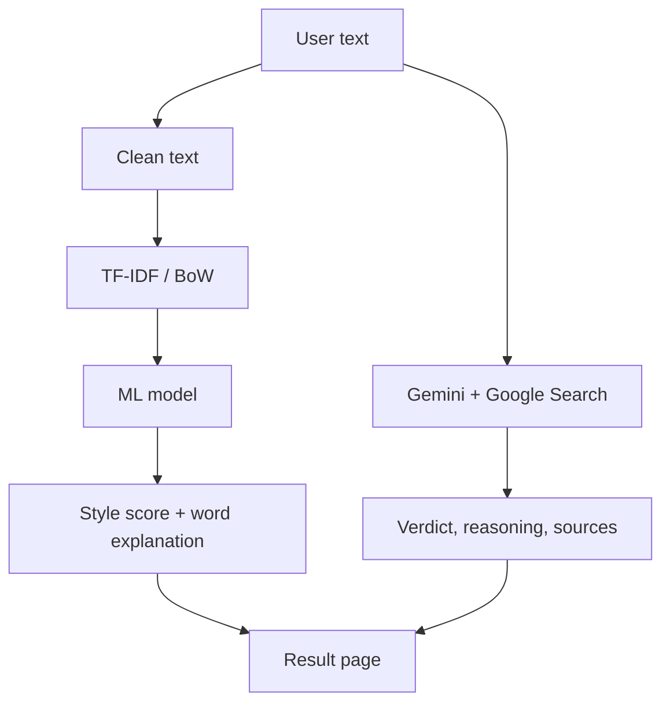

# Fake News Detector

You paste a news text into a web page and get two separate results.

1. **Writing style.** A model trained on the ISOT dataset says whether the text reads like fake news.
2. **Facts.** Gemini searches Google for the claims in the text and gives a verdict (True, False, Misleading or Unverified) with reasoning and source links.

The ML model only learns how fake news is written, so it cannot tell if a claim is actually true. That is why the Gemini check is the main result and the ML score sits next to it.


## How it works



Gemini gets the raw text, not the ML output, because it needs the original claims to search for. The source links come from Gemini's grounding data and not from its written answer, since models can make up URLs.

## ML part

- Dataset: [ISOT Fake and Real News](https://www.kaggle.com/datasets/clmentbisaillon/fake-and-real-news-dataset)
- Cleaning removes links, punctuation, stopwords and publisher tags like "(Reuters)"
- Features: TF-IDF and Bag of Words, 10k features, unigrams and bigrams
- Models: Logistic Regression, Naive Bayes, Random Forest (6 combinations, 80/20 split)


The same models are also tested on LIAR (short political statements) without retraining. The scores drop a lot compared to ISOT.


A separate Logistic Regression shows which words push a text towards fake or real, and the page highlights them in your text.


## LLM part

The prompts are in `prompts.py`. The system prompt tells Gemini to judge claims and not style, to answer "Unverified" when there is no evidence, and to reply in JSON only. The news text is wrapped in `<news_text>` tags and treated as data, so instructions pasted inside it are ignored.

## Files

| File | What it does |
|---|---|
| `fake_news_model.ipynb` | training, comparison, LIAR test, explainer |
| `preprocess.py` | text cleaning |
| `ml_predict.py` | loads the saved model, predicts and explains |
| `prompts.py` | Gemini prompts and JSON parsing |
| `llm_verify.py` | Gemini call and sources |
| `app.py` | FastAPI backend |
| `static/index.html` | web page |
| `sample_inputs.txt` | texts to try |

## Run it

Full steps are in [docs/INSTALLATION.md](docs/INSTALLATION.md). Short version:

```bash
python -m venv venv
venv\Scripts\activate
pip install -r requirements.txt
```

1. Put `Fake.csv` and `True.csv` in `data/` (and LIAR's `train.tsv` if you want the LIAR test).
2. Run all cells in `fake_news_model.ipynb`. This creates `models/` and the charts in `assets/`.
3. Copy `.env.example` to `.env` and add your Gemini key from [Google AI Studio](https://aistudio.google.com/apikey).
4. Run `python app.py` and open http://127.0.0.1:8000

If the Gemini model name stops working, change `GEMINI_MODEL` in `.env`.

The API is `POST /analyze` with `{"text": "..."}`, and it returns `{"ml": {...}, "llm": {...}}`.

## Limitations

- ISOT is mostly US political news from 2016 to 2017, so the high scores are partly because the dataset is easy. The LIAR test shows the models do not carry over well.
- The ML model learns style, not truth. A well written false article can look real.
- Gemini can be wrong or find no sources. The page shows a warning when no sources were found.
- This is a student project and not a replacement for real fact checking.

## Team

See [docs/CONTRIBUTIONS.md](docs/CONTRIBUTIONS.md). More screenshots are in `screenshots/`.
